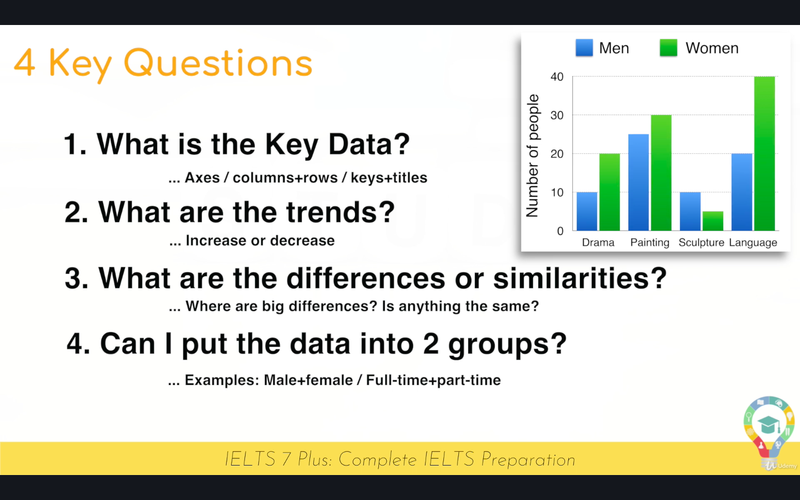
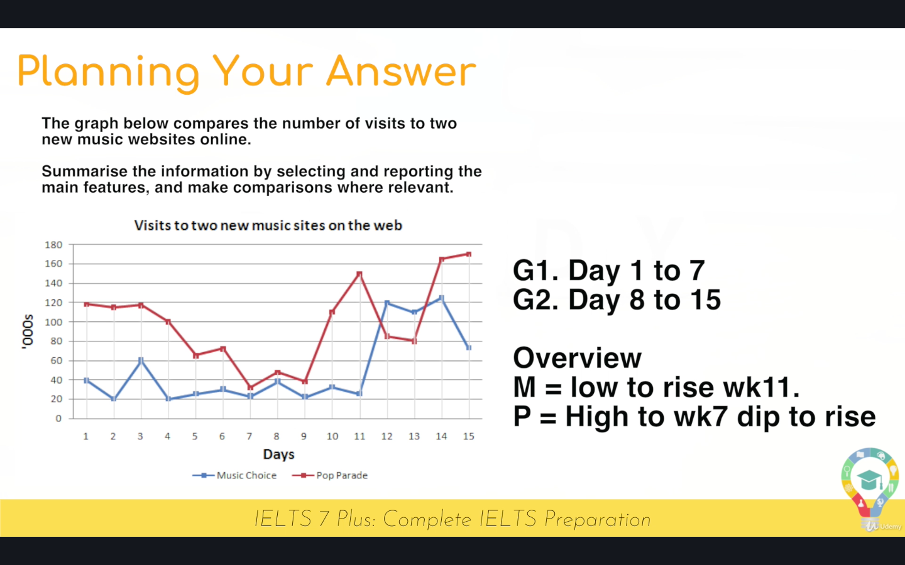
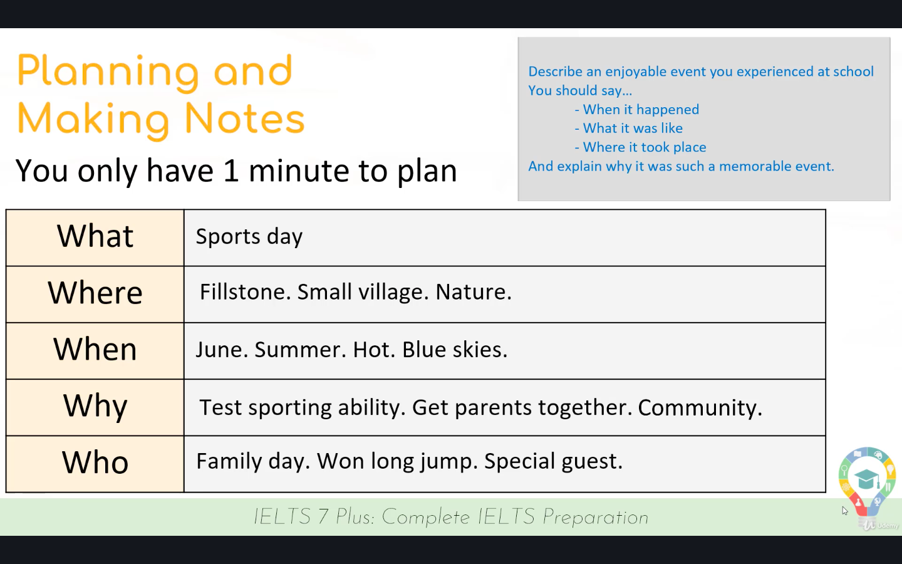
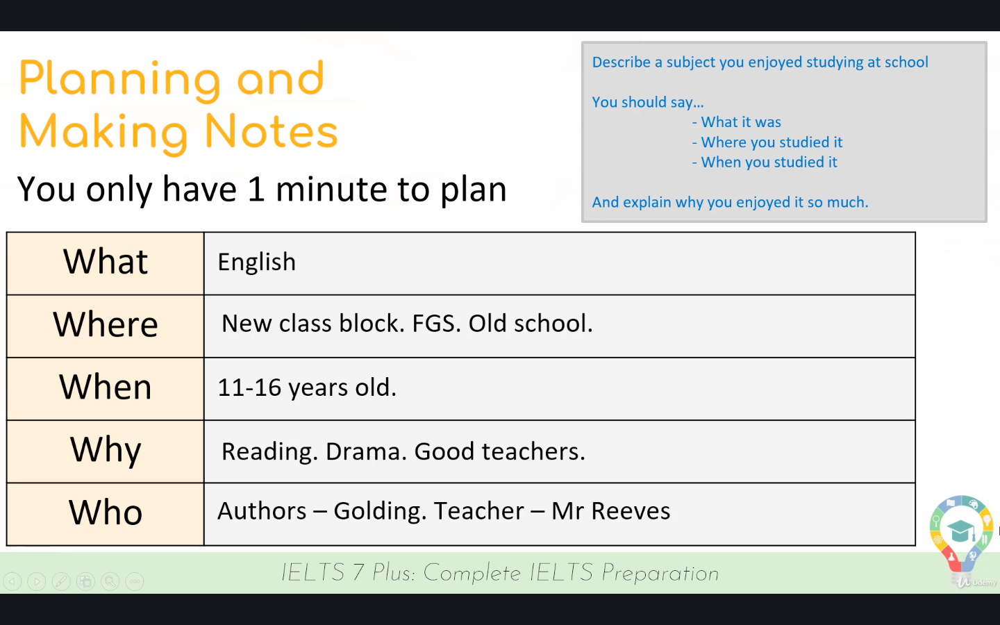
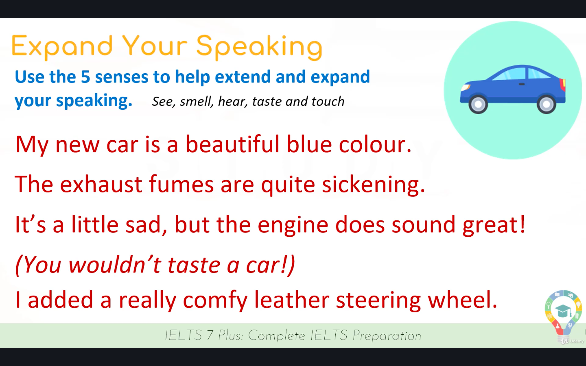

# IELTS 7 Plus

## IELTS Listening

- Total 30 minutes
- 40 questions

### Tips and Trick of Listening

- Practice a lot using online practice test
- Try to hear british accent (BBC Learning English)
- Listening script and question use a lot of synonym

### Common Mistake of Listening

- Not read the question first
- Not Predicting the answer
- Leaving Answer Blank
- Not pay attention to the instruction

---

## IELTS Writing Task 1


- 20 minutes for Task 1

### Important word

- Use 'axis and bar' to present chart and line chart
- Use 'slice' to present pie chart
- Use 'cells' to present flowchart

### Planning Answer





---

## IELTS Speaking

- Total 11 - 14 minutes
- Greetings and intro (work or study)
- Topic Cue Card (1 - 2 minutes)
- Interview style

### Section

1. Greetings and intro

   - Total 12 question
   - Don't give short answer
   - Use [Common Collocations](https://www.ieltsbuddy.com/collocation.html)

   Example :
   - What kind of food do you like ?
  
   ```text

    That's very good question. I usually prefer plain foods for the most. Sandwiches are my favorite foods. They are really delicious

   ```

   - Are you currently studying or working ?
  
   ```text

    At the moment, I'm working as software engineer at local company. It's very challenging but fascinating at the same time

   ```

2. Topic Cue Card

    - 1 Minutes to prepare
  
    

    
  
   - Extend speaking until 2 minutes

    

3. Interview Style

### How to score it


### Tips and Trick of Speaking

- Use [Conversation fillers](https://www.fluentu.com/blog/english/english-filler-words/)
- Use [Opinion Openers](https://www.youtube.com/watch?v=rV6DXkes7pQ)
- Use [Connectives](https://ielts-up.com/writing/ielts-linking-words.html)
- Use [Idiomatic Language](https://lovetolearnenglish.com/tips-for-ielts-and-toefl/idiomsforieltsspeaking)
  
  ```bash

  'Off the top of my head' = Without thinking too much about something

  'Warm Hearted' = Very kind and caring person

  'Down the road' = Something you want to do later

  'Cost an arm and a leg' = Very Expensive

  ```

### Grammar


#### Sentence Structures

- Simple Sentence

  ```text
  I love travelling to spain
  ```

- Compound Sentence

  ```text
  Cooking is real passion of mine but I'm not sure my food always tastes great
  ```

- Complex Sentence

  ```text
  Hopefully one day I'll be rich, but maybe it's just a dream
  ```

#### Conditional

- First (Possible in the future)

  ```text
  If it rains, I will get wet
  ```

- Second (Unlikely in the future)

  ```text
  If I was the president, I would make ice cream free
  ```

- Third (Different past, and possible future)

  ```text
  If you had won the race, you would have gotten a trophy
  ```

---
