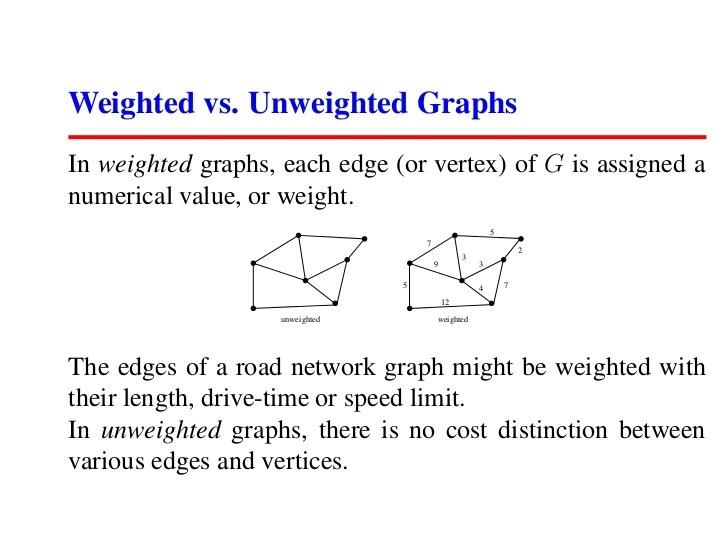
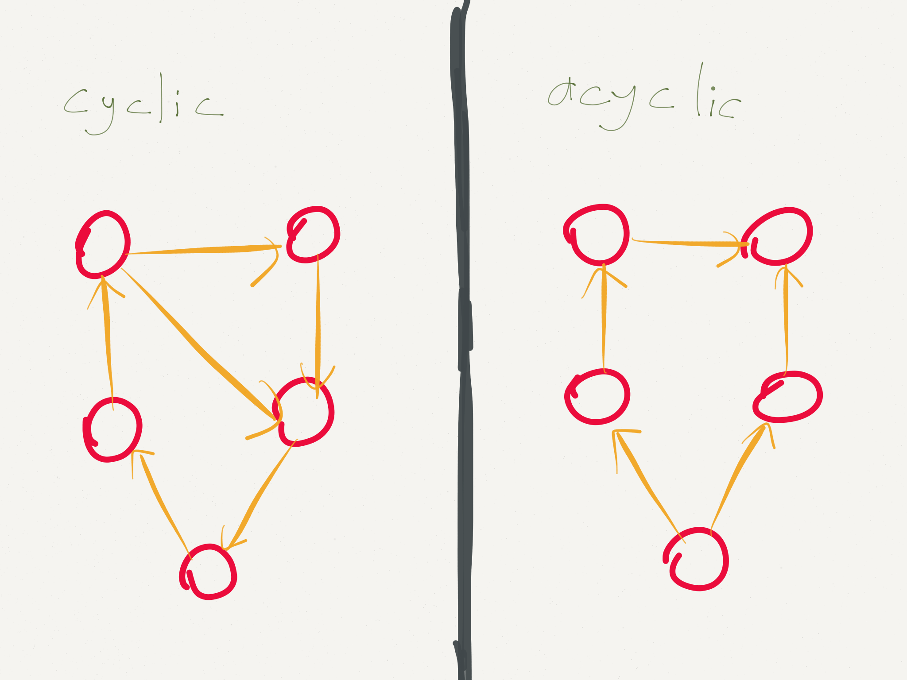
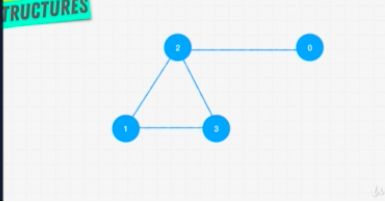

#

## Summary of Graphs

### Type of Graphs

Directed vs Undirected


Weighted vs Unweighted



Cyclic vs Acyclic



### Method to Build Graphs



Edge List

```javascript
//using array, where graphs[0] is currentNode and graphs[1] is linkedNode
const graphs = [
  [0, 2],
  [1, 3],
  [2, 1],
  [2, 3]
];
```

Adjacent List

```javascript
//using hash that describe connection
const graphs = {
  0: [2],
  1: [2, 3],
  2: [0, 1, 3],
  3: [1, 2]
};
```

Adjacent Matrix

```javascript
//using matrix 1(linked) and 0(not linked)
const graphs = {
  0: [0, 0, 1, 0],
  1: [0, 0, 1, 1],
  2: [1, 1, 0, 1],
  3: [0, 1, 1, 0]
};
```
